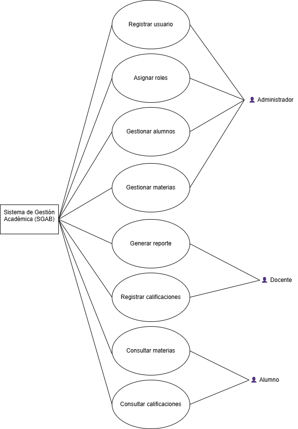

# Especificación de Requisitos del Sistema
Sistema de Gestión Académica Básico (SGAB)

---

## 1. Introducción

El presente documento describe los requisitos funcionales y no funcionales del Sistema de Gestión Académica Básico (SGAB). Su propósito es definir de manera clara y verificable el comportamiento esperado del sistema antes de su implementación.

---

## 2. Descripción General del Sistema

El SGAB es una aplicación web diseñada para administrar alumnos, materias, calificaciones y usuarios dentro de una institución educativa. El sistema operará mediante control de acceso basado en roles.

---

## 3. Actores del Sistema

- Administrador
- Docente
- Alumno

---

## 4. Requisitos Funcionales

RF-01: El sistema deberá permitir al administrador registrar nuevos usuarios.

RF-02: El sistema deberá permitir al administrador asignar roles a los usuarios (Administrador, Docente, Alumno).

RF-03: El sistema deberá permitir a los usuarios autenticarse mediante credenciales válidas.

RF-04: El sistema deberá permitir registrar, modificar y eliminar alumnos.

RF-05: El sistema deberá permitir registrar, modificar y eliminar materias.

RF-06: El sistema deberá permitir a los docentes capturar calificaciones por alumno y materia.

RF-07: El sistema deberá permitir a los alumnos consultar sus calificaciones.

RF-08: El sistema deberá permitir generar un reporte básico de calificaciones por alumno.

---

## 5. Requisitos No Funcionales

RNF-01: El sistema deberá implementar control de acceso basado en roles para garantizar la seguridad de la información.

RNF-02: El sistema deberá estar disponible al menos el 95% del tiempo durante horario escolar.

RNF-03: El tiempo de respuesta no deberá superar los 3 segundos en operaciones estándar.

RNF-04: La interfaz deberá ser intuitiva y consistente para facilitar su uso.

RNF-05: El sistema deberá realizar respaldos periódicos de la base de datos.

RNF-06: El sistema deberá poder operar correctamente con hasta 100 usuarios concurrentes.

---

## 6. Justificación de Requisitos No Funcionales

### Seguridad (RNF-01)

La seguridad es crítica debido a que el sistema manejará información académica sensible, incluyendo calificaciones y datos personales. La ausencia de control de acceso podría permitir modificaciones no autorizadas y comprometer la integridad del sistema.

### Disponibilidad (RNF-02)

La disponibilidad es esencial para evitar interrupciones en procesos académicos. Si el sistema no está accesible durante horarios escolares, afectaría la captura de calificaciones y la consulta de información por parte de alumnos y docentes.

---

## 7. Módulos del Sistema

El sistema se divide en los siguientes módulos:

1. Módulo de Autenticación y Control de Acceso  
2. Módulo de Gestión de Usuarios  
3. Módulo de Gestión de Alumnos  
4. Módulo de Gestión de Materias  
5. Módulo de Gestión de Calificaciones  
6. Módulo de Reportes  

Cada módulo cumple una responsabilidad específica dentro de la arquitectura del sistema.

---

## 8. Diagrama de Casos de Uso

A continuación se presenta el diagrama de casos de uso del sistema:

